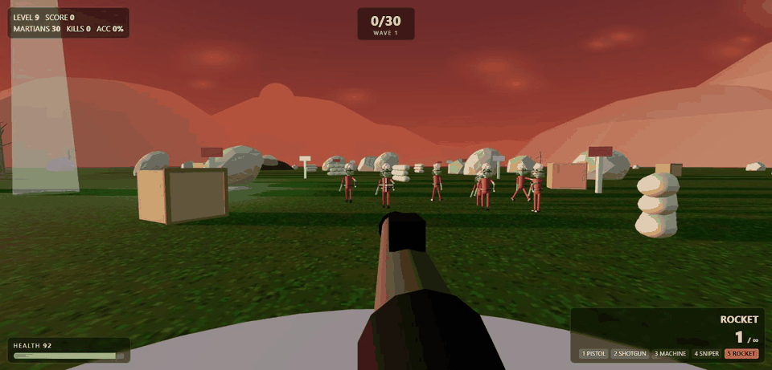
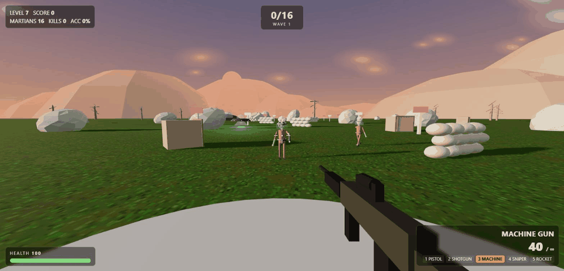
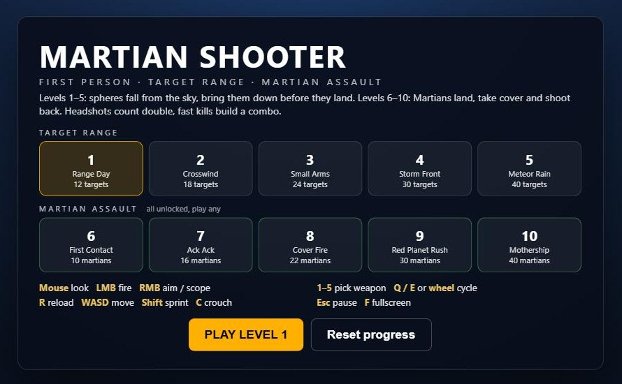
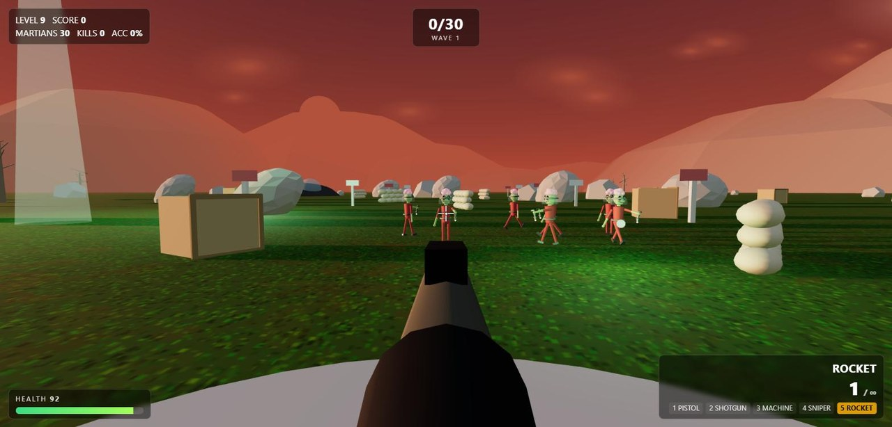
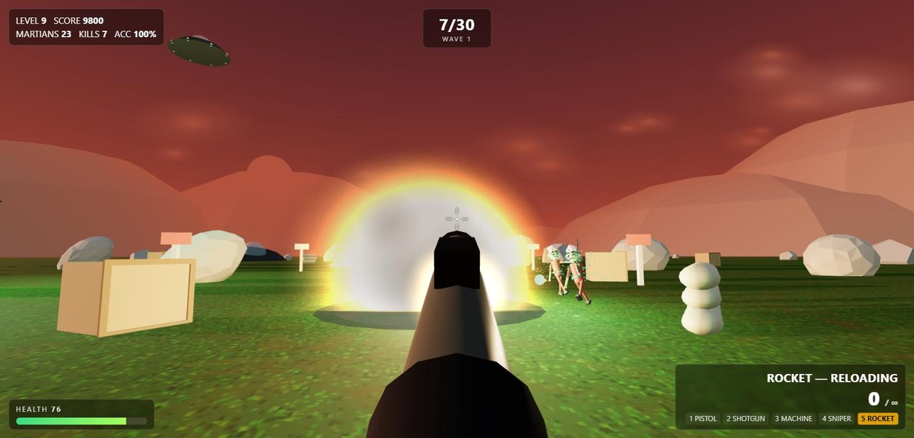
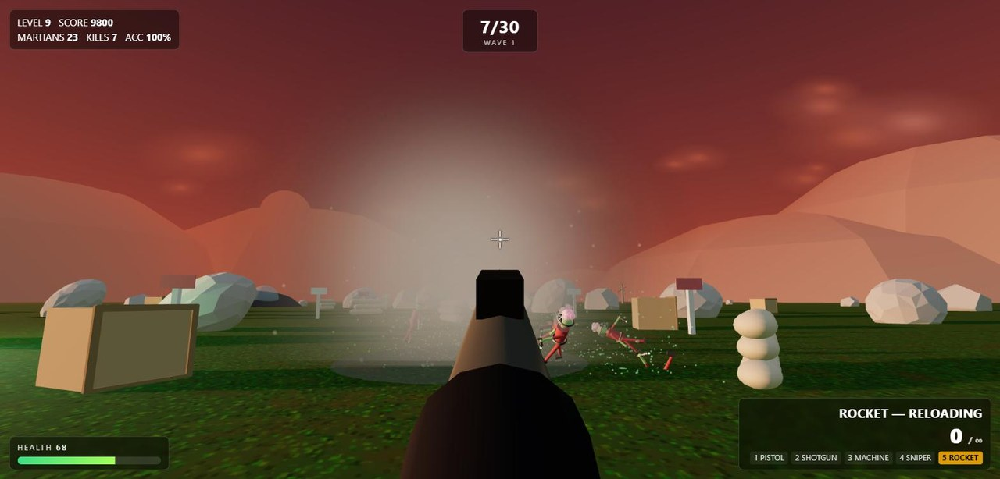
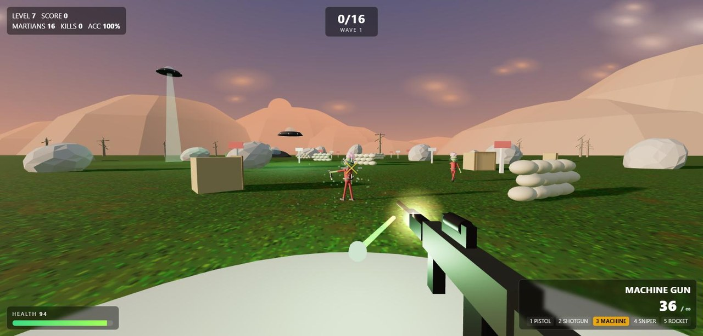
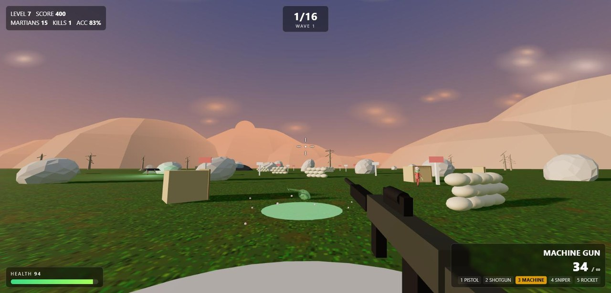

# Martian Shooter

**▶ PLAY IN YOUR BROWSER: https://loco306.github.io/martian-shooter/**

A first-person shooter that runs in any desktop browser. No install, no login, no download. Click the link, click PLAY, shoot.

Ten levels. The first five are a target range where glowing spheres fall out of the sky and you bring them down before they land. The last five are the **Martian Assault**: little green men drop from saucers, take cover behind rocks and crates, flank you, and shoot back. Headshots count double, fast kills chain into combos, and every Martian you drop tumbles, bleeds green and melts into a puddle.

## Controls

| Action | Key |
|---|---|
| Look / fire | Mouse / left button |
| Aim down sights (sniper scope) | Right button |
| Move / sprint / crouch | WASD / Shift / C |
| Pick weapon | 1 Pistol · 2 Shotgun · 3 Machine Gun · 4 Sniper · 5 Rocket |
| Cycle weapon | Q / E or mouse wheel |
| Reload | R |
| Pause / fullscreen | Esc / F |

All five Martian Assault levels are unlocked from the start. Pick any of them from the menu.

## Screenshots

| | |
|---|---|
|  |  |
|  |  |
|  |  |

## How it was built

The whole game is one HTML file (`index.html`, about 77 KB) plus a local copy of Three.js r128. It was written with Claude Code (Fable 5.1) in two sittings: the first built the target-range game with five levels and five weapons, the second added the Martian Assault, the alien AI, the realistic weapon audio and the visual upgrades.

- **Rendering:** Three.js with a custom sky shader per level (ten skies, including the red Mars sky of the later levels), procedurally generated grass, rock and metal textures drawn on canvases at load time, and a rolling low-poly mountain ring.
- **Weapons:** five weapons with distinct recoil, spread, fire rate and reload. Hitscan weapons raycast for the hit and then spawn a fast tracer mesh along the same line so what you see is what you hit. The rocket is a real projectile with gravity, a proximity fuse and splash damage.
- **Sound:** every sound is synthesized with the WebAudio API at runtime. Gunshots are layered noise bursts and low-frequency thumps through a convolver reverb; the machine gun gets a heavier, louder layer; rockets get a whoosh plus a long boom.
- **Martians:** a small state machine per alien (seek, cover, peek, charge, dodge) over five types: grunt, runner, camper, jumper and sniper. They pick the nearest cover, lean out to fire bursts of green bolts, dodge when you aim at them, and rush you when close. Kills fling the body with a random spin, spray green blood particles and shrink the body into a puddle.
- **Effects:** additive glow sprites for muzzle flash, tracers, fireballs and smoke; round particle textures so explosions read as fire, not squares.
- **Progress:** saved in the browser with localStorage.
- **Testing:** the game exposes a debug hook so the whole simulation can be stepped frame by frame from the console. Every screenshot and GIF in this README was captured that way, with a scripted rocket fired into a scripted Martian squad.

## Run it locally

Clone or download the repo and open `index.html` in a browser. It loads Three.js from the same folder, so it works offline. On Windows the included `SkyShooter.ico` makes a nice desktop shortcut icon.

Built by Caleb with Claude Code. Fork it, mod it, add a level.
